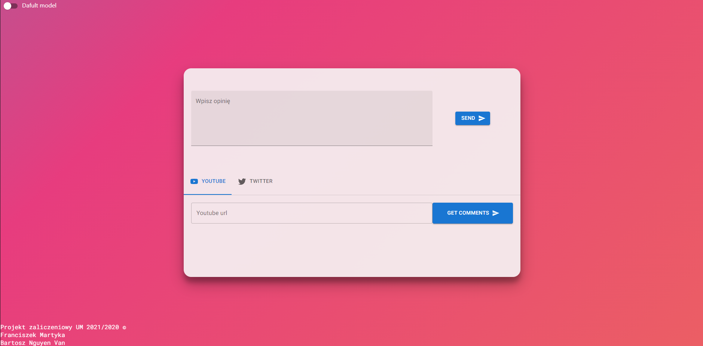

# Project for machine learning classes - NLP sentiment analysis

The goal of this project was to build fullstack ML webapp capable of Polish sentiment analysis. It consits of model building with keras, python/flask backend and client side ReactJs UI. User can get the sentiment prediction about a single opinion, or use youtube/twitter connection to get a sentiment of user comments either from youtube video comments or from replies to the last tweet of particaullar user.

### UI:

209.250.235.144
[](https://app.netlify.com/sites/trusting-yonath-b7ea0e/deploys)



### Development

create .env file at root directory

```
YOUTUBE_TOKEN='token'
TWITTER_API_KEY='key'
TWITTER_API_KEY_SECRET='secret token'
TWITTER_BEARER_TOKEN = 'token'
IBM_TOKEN='ibm cloud token'
```
